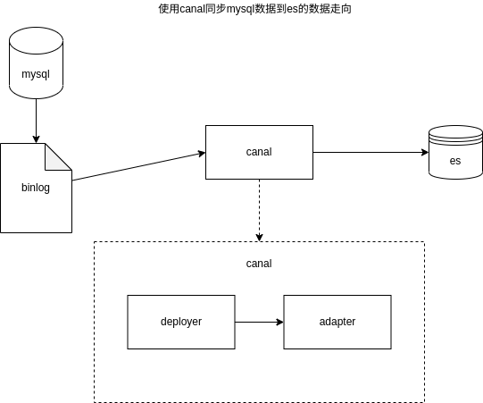

# MYSQL -> ES 数据同步


## 简介
在实际生产使用过程中，业务会使用多种数据结构解决不同的业务问题，
比如使用 RDBS 关系形数据库存储 业务数据，再使用类似 ES 的 NOSQL 类数据库完成全文检索的需求，
而不同的数据同步策略又与业务存在很大的联系，此文给出从 RDBS(MYSQL)到ES(ElasticSearch) 的同步解决方案。
比如最典型的例子，在电商系统总，商品实际的CURD操作在 RDBS 中，但是RDBS中的数据并不适和大量的执行检索操作(暂时不考虑mysql的全文检索功能)，故将商品的检索信息放入ES中执行是一个中大型电商系统的基本操作。


## 方案思考
当前做数据同步的方案不止一个，在实际操作之前需要思考哪种方案适合实际的需求
需要考虑的点：
### 1. 数据流向
> 数据很明显是从 `mysql -> es` 这点毋庸置疑，但是需要思考的是，是否需要在其中引入 `MQ` 中间件的加入， `MQ` 会增加系统的复杂度，但同时带来系统的高扩展性 比如将增量的数据同时输出到多个下游系统


### 2. 同步策略
同步策略是个重点的策略，从同步方式和实时性来看可以分为 `流处理实时同步` `批处理准实时同步` 两种同步模式 同时流处理和批处理是两个与业务关联性更高的话题，直接影响之后的整个同步系统的架构，在选择的时候需要结合业务考虑
1. 流处理实时同步: 
    1. 技术考量： 需要使用流处理操作就必须考虑数据库的实时文件同步功能(此处是MYSQL 的 binlog) 原理是将 `binlog` 中的数据当作 source 直接增量同步到 目标数据库中
    2. 业务考量： 实时的流处理是数据同步速度最快的方式，对数据的修改可以在很短的时间内直接反馈到结果上，数据的新增/修改 操作快 对业务的影响也就小
    3. 注意点： 数据库需要支持并开启 `binlog` 类似的数据同步/备份机制，索性几乎流行的 RDBMS 都有类似功能


2. 批处理准实时同步: 
    1. 技术考量： 需要使用批处理操作获取最新的数据，简单的方案就是直接使用数据库查询语句(select)外加数据的新增修改时间戳字段(类似sql `select * from xxx where create_time>last_sync_time or update_time>last_sync_time`)，直接获取最新的数据，再增量同步到 目标数据库中
    2. 业务考量： 批处理数据旨在在一个时间范围内获取改动，再同步到目标数据库，故数据同步的时效性取决于数据的同步周期，数据同步周期不宜过短;给到前端就会产生一个数据延迟操作，但数据批处理正因为存在同步周期，故更加适合之后的数据处理中需要数据集上下文的情况
    3. 注意点： 待同步的数据库表需要存在可供查询的时间戳字段

### 3. ETL CDC(change data capture)
需要关注的另外一点是数据的ETL CDC操作，虽然最最简单的数据同步操作没有必要考虑数据的CDC，但是现实情况往往会存在当数据同步的时候，新增、修改删除原有数据的功能，这个也是业务需要考量的部分; 无论是最简单的过滤空值、数据处理、还是复杂的求和分组亦或是其他业务，ETL和CDC功能始终是一个需要考量的点

在此大致比较 `流处理实时同步` `批处理准实时同步`:

|  | 流处理实时同步 | 批处理准实时同步 |
| --- | --- | --- |
| 实时性 | 高 | 中(取决于同步周期，但周期不宜过小)|
| 系统复杂度 | - | - |
| 操作的系统层级 | 低 | 高 |
| 扩展性 | 低 | 高(操作层级高，获取数据上下文也更加方便) |
| 需要数据库支持程度 | 需要开启并能获取binlog | 仅需要执行SQL权限 |
| 数据支持程度 | - | 需要数据中存在新增、修改的时间戳 |
| ETL方案 | 复杂 | 较简单 |

    
> **注意**: 在实际生产中，数据一致性是一个非常大的考量因素，初期在系统架构不完善的情况下无论是流处理还是批处理，都可能存在数据无法及时同步的情况，故需要考虑一个全量的同步策略进行兜底，在数据同步发生错误时能及时的补救; 但是这种方式也需要目标库有能力重建整个数据集，所以在ES处的手动和每一段时间重建索引的功能是十分有必要的。

关于同步策略的总结：1. 流处理 批处理 根据以上业务选择 2. 是否启用MQ可以考虑整个系统，如果仅仅考虑mysql到es的数据同步业务，则不需要使用


## 相关工具及选择
由于同步操作涵盖业务广，故而很多CDC工具也能完成相关操作。在此可以先列举一部分需要使用到的工具

### 工具 中间件
数据源: `Mysql-8.0` 目标位置: `ElasticSearch-8.3`
数据同步工具: 
    `Canal` `Maxwell` `Debezium` `Flume` `Logstash` `DataX` 
MQ：
    `Kafka` `RabbitMQ` 
复杂业务情况需要使用自定义代码完成功能: 
    `Flink` `Spark` 或者 自定义数据同步服务

### 工具选择
1. MQ 中 `Kafka` 对其他各个组件的支持较为简单且已有稳定支持 优先考虑
2. 数据同步工具各有优劣 考虑使用几种方案各进行尝试

## 前置准备
1. Mysql-8.0 ES-8.3 安装完成 [mysql-es-setup](./prepare/mysql-es-setup.md) 
2. mysql开启 binlog 功能(\*) 并且 指定了有权限的用户 [mysql-binlog](./prepare/mysql-binlog.md)
3. 创建相关的数据 mysql 的 库表 和 es 的 index mapping
4. kafka(\*) 已经安装完成
5. spark(\*) flink(\*)

## [不推荐] 使用 Canal 将 Mysql 数据同步到 ES
Canal 作为阿里开源的数据同步工具，基于 binlog 将数据库同步到其他各类数据库中，目标数据库支持mysql,postgresql,oracle,redis,MQ,ES等
当前的 canal 支持源端 MySQL 版本包括 5.1.x , 5.5.x , 5.6.x , 5.7.x , 8.0.x
官方简介: [canal-introduction](https://github.com/alibaba/canal/wiki/Introduction)


这里我们使用 `1.1.6`(2022-05-24) release版本的 canal 执行下面的操作

### 架构图
canal 中各个组件的定义:
>canal-admin
>canal-admin设计上是为canal提供整体配置管理、节点运维等面向运维的功能，提供相对友好的WebUI操作界面，方便更多用户快速和安全的操作
>[canal-admin](https://github.com/alibaba/canal/wiki/Canal-Admin-Guide)
>
>canal-adapter
>增加客户端数据落地的适配及启动功能(支持HBase等)
>[canal-adapter](https://github.com/alibaba/canal/wiki/ClientAdapter)
>
>canal-deployer
>这个就相当于canal的服务端，启动它才可以在客户端接收数据库变更信息。
>[canal-deployer](https://github.com/alibaba/canal/wiki/QuickStart)

既然使用 canal 作为数据传输工具 且 canal 有能力直接将数据放入es中，则考虑使用架构:



### 集群机器分配说明
[service](./config/service.md)

不通过 mq 直接将数据从 mysql 放入 es
### 实际操作
1. canal 安装 解压
```bash
wget https://github.com/alibaba/canal/releases/download/canal-1.1.6/canal.deployer-1.1.6.tar.gz
wget https://github.com/alibaba/canal/releases/download/canal-1.1.6/canal.admin-1.1.6.tar.gz
wget https://github.com/alibaba/canal/releases/download/canal-1.1.6/canal.adapter-1.1.6.tar.gz
```

2. mysql 创建 canal 用户
```sql
CREATE USER 'canal' IDENTIFIED BY 'canal';
GRANT SELECT, REPLICATION SLAVE, REPLICATION CLIENT ON *.* TO 'canal'@'%';
FLUSH PRIVILEGES;
```

3. mysql 依赖修改
canal 的 lib 中仅有 mysql5 的驱动 需要添加 mysql8的驱动

4. 修改配置参见配置文件夹 [config/canal](./config/canal/readme.md)

5. 启动/停止 canal-deployer
```bash
# 启动
./deployer/bin/startup.sh

# 停止
./deployer/bin/stop.sh
```

6. (可选) `deployer` 成功启动后 就可以通过tcp连接 `deployer` 服务器 通过 `canal-client` 的api获取数据
canal-client-demo: https://code.aliyun.com/lumiseven/canal-t1.git

7. 配置 canal-adapter
通过 `adapter` 对接 `es` 数据源
```bash
# 启动
./adapter/bin/startup.sh

# 停止
./adapter/bin/stop.sh
```

8. 使用体验(canal 1.1.6)
    1. 文档旧 bug多 需要稍微了解源代码才能使用 否则报错原因都不知道 项目结构和架构相对于功能来说增加了无用的复杂
    2. `es8+` 需要配置 `es7` api 可以达到同样效果 各个配置没有说明需要自己尝试
    3. 系统分为 deployer adapter admin(web-ui 控制台就不考虑了)， 其中 deployer 为核心 可以单独拆分 后端服务支持 tcp/kafka; adapter可以对接es hbase kylin mysql 但配置总体相对复杂且文档中配置过老需要摸索或者查看源码，且可靠性无法保证
    4. **对 mysql8+ 的支持很糟糕** 虽然可以手动加入 jar 但是 deployer 使用一段时间后 `...unrecognized binlog event Unknown type:xx...` 应该是mysql版本新增type不支持造成的。再长时间后还会出现 position 严重超过实际值的情况，发生之后不 修改/重置position(1.删除 conf 中的 meta.dat 2.删除logs 中的 meta.log) 的话无法使用
    5. 仅尝试了 `mysql-binlog -> deployer -> adapter -> es` 和 `mysql-binlog -> deployer -> tcp自定义代码` 两种使用方式 太费时间
    6. es 的 adapter 当前似乎无法使用覆盖的方式提交数据，所以需要存在 全量同步+增量同步 两套方案
    <!-- 6. 总的来说 单单deployer 可以考虑使用，adapter不考虑使用 通过deployer将数据投递到kafka或许是canal的解决方案中唯一靠谱的 -->

### canal -> kafka
不使用 `canal-adapter` 转而通过 `canal-deployer` 将数据投递到 `kafka`
减少配置以及不稳定性，提高了项目复杂度，但是相比 adapter 扩展性增强

[mysql-canal-kafka](./img/mysql-canal-kafka.png)
1. 修改 `canal-deployer` 配置
```properties
...
canal.serverMode=kafka
...
kafka.bootstrap.servers = 127.0.0.1:9092
...
```

2. 修改 `instance.properties` 配置
```
...
# 默认使用 console_mysql_binlog topic存放
canal.mq.topic=console_mysql_binlog

# gmall 库的所有表放入 console_mysql_binlog_gmall topic
canal.mq.dynamicTopic=console_mysql_binlog_gmall:gmall
canal.mq.partition=0
```

3. 提前创建 kafka topic 当然也可以通过 `canal-deployer` 启动后自动创建
4. 启动 `canal-deployer`

