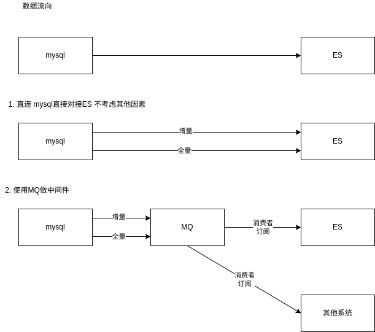

# MYSQL -> ES 数据同步

## 简介
在实际生产使用过程中，业务会使用多种数据结构解决不同的业务问题，
比如使用 RDBS 关系形数据库存储 业务数据，再使用类似 ES 的 NOSQL 类数据库完成全文检索的需求，
而不同的数据同步策略又与业务存在很大的联系，此文给出从 RDBS(MYSQL)到ES(ElasticSearch) 的同步解决方案。
比如最典型的例子，在电商系统总，商品实际的CURD操作在 RDBS 中，但是RDBS中的数据并不适和大量的执行检索操作(暂时不考虑mysql的全文检索功能)，故将商品的检索信息放入ES中执行是一个中大型电商系统的基本操作。

## 方案思考
当前做数据同步的方案不止一个，在实际操作之前需要思考哪种方案适合实际的需求
需要考虑的点：
1. 数据流向
    数据很明显是从 `mysql -> es` 这点毋庸置疑，但是需要思考的是，是否需要在其中引入 `MQ` 中间件的加入， `MQ` 会增加系统的复杂度，但同时带来系统的高扩展性 比如将增量的数据同时输出到多个下游系统

2. 同步策略
    同步策略是个重点的策略，基本可以分为 `流处理实时同步` `批处理准实时同步` 流处理和批处理是两个与业务关联性更高的话题，直接影响之后的整个同步系统的架构
    1. 流处理实时同步: 
        1. 技术考量： 需要使用流处理操作就必须考虑数据库的实时文件同步功能(此处是MYSQL 的 binlog) 原理是将`binlog`中的数据当作 source 直接增量同步到 目标数据库中
        2. 业务考量： 实时的流处理是数据同步速度最快的方式，对数据的修改可以在很短的时间内直接反馈到结果上，数据的新增/修改 操作快 对业务的影响也就小
        3. 注意点： 数据库需要支持并开启 `binlog` 类似的数据同步/备份机制，索性几乎流行的 RDBMS 都有类似功能
    2. 批处理准实时同步: 
        1. 技术考量： 需要使用批处理操作获取最新的数据，简单的方案就是直接使用数据库查询语句(select) 外加数据的新增修改时间戳字段，直接获取最新的数据，再增量同步到 目标数据库中
        2. 业务考量： 批处理数据旨在在一个时间范围内获取改动，再同步到目标数据库，故数据同步的时效性取决于数据的同步周期，数据同步周期不宜过短;给到前端就会产生一个数据延迟操作，但数据批处理正因为存在同步周期，故更加适合之后的数据处理中需要数据集上下文的情况
        3. 注意点： 待同步的数据库表需要存在可供查询的时间戳字段(类似sql `select * from xxx where create_time>last_sync_time orf update_time>last_sync_time`)
    
* 但是在实际生产中，数据一致性是一个非常大的考量因素，初期在系统架构不完善的情况下无论是流处理还是批处理，都可能存在数据无法及时同步的情况，故需要考虑一个全量的同步策略进行兜底，在数据同步发生错误时能及时的补救; 但是这种方式也需要目标库有能力重建整个数据集，所以在ES处的每一段时间重建索引的功能是十分有必要的。

总结：1. 流处理 批处理 根据业务选择

根据业务类型判断合理的数据同步方案